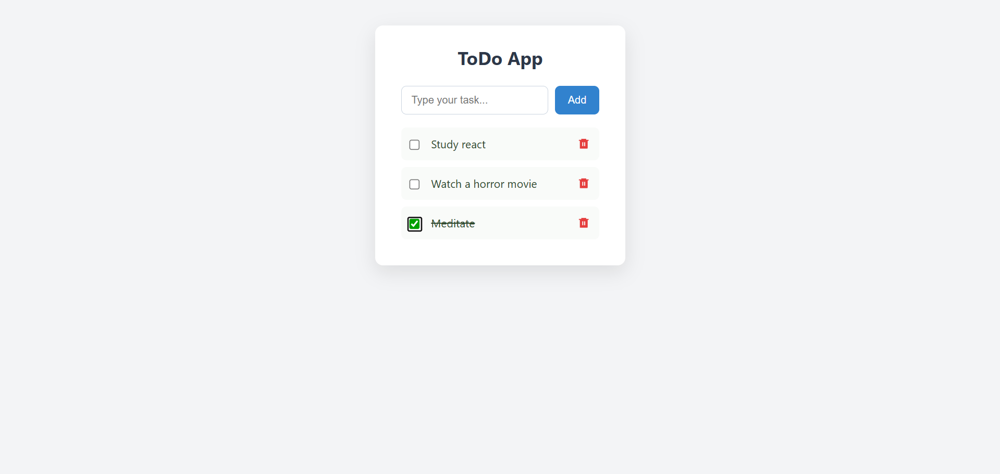

<h1 align="center">📝 React ToDo App</h1>

<p align="center">
  A beautifully minimal ToDo application built with <strong>React</strong> and <strong>Vite</strong>, styled using modern <strong>CSS Modules</strong>. Designed for speed, focus, and simplicity.
</p>

<p align="center">
  
  
  
</p>

---

## ✨ Features

- ⚡ **Fast**: Powered by Vite’s lightning-fast bundler.
- 🎯 **Focused**: Clean, distraction-free task management.
- ✅ **Functional**: Add, complete (strike-through), and delete tasks.
- 🎨 **Styled**: Clean UI using CSS Modules — no global leaks.
- 🧠 **Beginner-Friendly**: Perfect starter project to learn React basics.

---

## 🌍 Live Demo

[👉 View Live Project](https://todo-snap.netlify.app)

---

## 🖼️ Preview




---

## 🛠️ Tech Stack

| Tool       | Purpose                  |
|------------|--------------------------|
| ⚛️ React   | UI Library               |
| ⚡ Vite     | Fast Dev Environment     |
| 🎨 CSS Modules | Scoped Styling         |
| 🎯 React Icons | Iconography             |

---

## 🔧 Getting Started

```bash
git clone https://github.com/alensharhan/ToDoApp-React.git
cd react-todo-app
npm install
npm run dev
